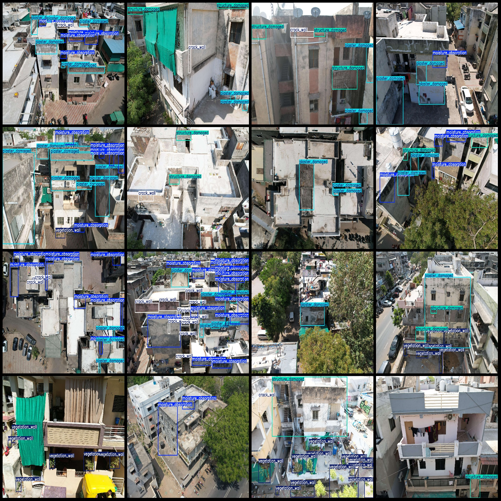
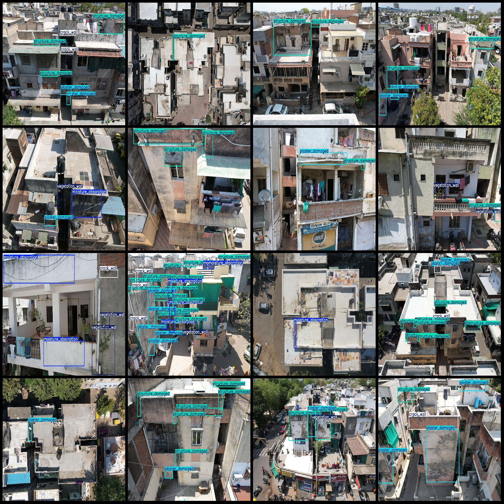

# Drone View of Rural House Building Damage and Vegetation Return Moisture Cracks Detection Dataset (VOC+YOLO format with 1304 images in 5 categories)

Dataset format: Pascal VOC format + YOLO format (txt file without split path, containing only jpg images and corresponding VOC format xml files and yolo format txt files)
Number of images (jpg file count): 1304
Number of annotations (xml file count): 1304
Number of annotations (txt file count): 1304
Number of annotation categories: 5
Annotation category names (Note that the yolo format category order does not correspond to this, and should be based on the labels folder classes.txt): ["crack_wall", "moisture_absorption", 
"plaster_damaged", "structure_damaged", "vegetation_wall"]
Boxes per category:
- crack_wall (Wall Cracks) boxes = 1801
- moisture_absorption (Wall Moisture) boxes = 1984
- plaster_damaged (Plaster Damaged) boxes = 2490
- structure_damaged (Structure Damaged) boxes = 1758
- vegetation_wall (Vegetation) boxes = 1020
Total boxes: 9053
Image resolution: 1920x1280
Drone: DJI MAVIC 3
Collecting height: 15-30m
Collecting angle: 0-90°
Annotation tool used: labelImg
Annotation rules: Draw a box around the category
Important note: The dataset does not have a separate training/validation/test set; you need to divide it yourself.
Special declaration: This dataset does not guarantee any accuracy for models trained on it or the weights of the files.
Image preview:

## Images

Here is a pay link on Stripe ( https://buy.stripe.com/3cs8yP7sY87d0vu9AB ). Please contact me lonlonago@foxmail.com after funding $89, and I will send you a complete data files , thank you!

